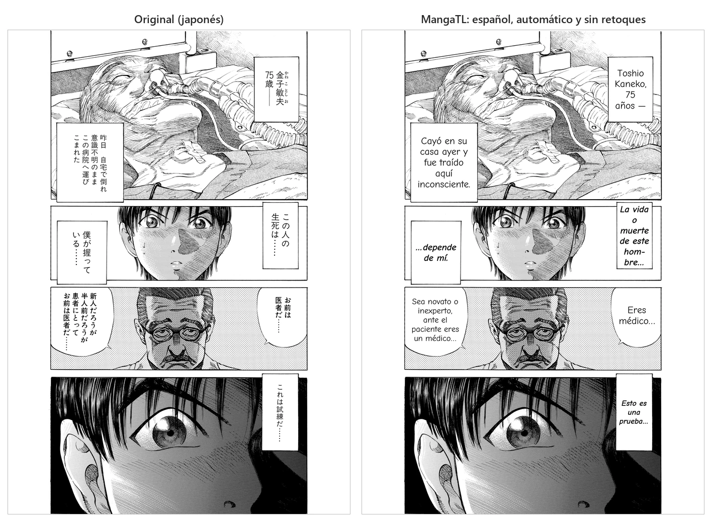
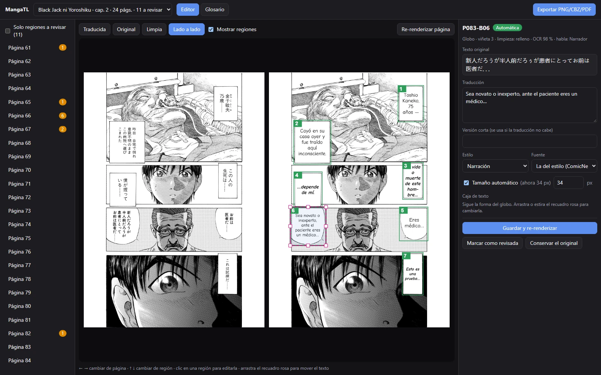

# MangaTL

[](https://github.com/Misa3L01/MangaTL/actions/workflows/ci.yml)
[](LICENSE)


Traductor automático de manga (japonés / inglés → español), **100 % local y gratuito**.
Detecta globos, lee el texto con OCR, lo traduce con un LLM local (Ollama) usando el contexto
del capítulo, limpia el texto original y rotula la traducción dentro de cada globo.



<sub>Página de *Black Jack ni Yoroshiku* © Shuho Sato (佐藤秀峰), obra liberada por su autor
para uso secundario ([condiciones](https://densho810.com/free/)). Resultado automático con
`qwen3.5:9b`, sin retoques.</sub>

> **Estado:** Fase 3 completa: además de todo lo anterior (japonés e inglés, LaMa, orden por
> viñetas, glosario por serie, versión corta, PDF), hay un **editor web local**
> (`mangatl ui`) para revisar y corregir cada página. Desde octubre de 2026 la traducción local
> es **2,25× más rápida** con la misma calidad ([experimentos](#experimentos-de-optimización-octubre-de-2026)).
> Ver [Limitaciones actuales](#limitaciones-actuales-fase-2) y la [hoja de ruta](#hoja-de-ruta).

## Características

- **Entradas:** carpeta de imágenes, `.zip`, `.cbz` o `.pdf`, con orden natural de páginas y
  detección de páginas dobles.
- **Detección** de globos, cuadros de narración y texto sobre el dibujo (RT-DETR-v2), con la
  forma real de cada globo y orden de lectura por viñetas.
- **OCR** en japonés (manga-ocr, texto vertical) y en inglés (PP-OCR), con detección automática
  del idioma.
- **Traducción con contexto** por bloques de páginas: glosario y resúmenes por serie, salida
  JSON validada y reintentos automáticos.
- **Limpieza** con relleno en los globos lisos y con **LaMa** sobre el dibujo y las tramas.
- **Rotulado** que sigue la forma del globo, con división silábica en español y estilos (grito,
  susurro, pensamiento, narración).
- **Editor web local** para revisar y corregir cada región y re-renderizar la página en segundos.
- **Exportación** a PNG, CBZ y PDF, más un informe HTML de revisión.
- **Sin APIs de pago:** todo corre en tu GPU; el chat de claude.ai es una alternativa manual
  opcional.

---

## Requisitos

- Windows 10/11 con GPU NVIDIA y driver reciente (probado con RTX 4050 Laptop 6 GB, driver 616.64).
- ~15 GB libres en la unidad del proyecto (ver [Espacio en disco](#espacio-en-disco)).
- 16 GB de RAM: el modelo por defecto (`qwen3.5-texto:9b`, el Qwen3.5 9B sin visión) usa
  ~4,4 GB de VRAM y ~1 GB de RAM con `num_gpu = 27`; conviene cerrar el navegador y juegos
  mientras traduce.
- Git (opcional) y conexión a internet solo para la instalación.

No hace falta instalar Python, CUDA Toolkit ni Ollama por separado: todo se instala dentro de
la carpeta del proyecto.

## Instalación (Windows, paso a paso)

Todo (uv, Python, dependencias, modelos, Ollama y cachés) se instala **dentro de la carpeta del
proyecto**, y no se modifica ninguna variable de entorno permanente de Windows. Los ejemplos usan
`R:\Manga-Translate`, pero puede ser cualquier carpeta.

1. Descarga el proyecto (con Git o con *Code → Download ZIP*) y abre PowerShell en su carpeta:

   ```powershell
   git clone https://github.com/Misa3L01/MangaTL.git R:\Manga-Translate
   cd R:\Manga-Translate
   ```

2. Carga el entorno de la sesión. **Hazlo siempre** al abrir una terminal nueva para trabajar
   en el proyecto: redirige todas las cachés (uv, Hugging Face, PyTorch, Ollama, temporales) a la
   carpeta del proyecto.

   ```powershell
   . .\env.ps1
   ```

   Si PowerShell bloquea el script, habilítalo solo para esa sesión con
   `Set-ExecutionPolicy -Scope Process Bypass`.

3. Instala uv, Python 3.12 y las dependencias (PyTorch con CUDA incluido, ~2,2 GB de descarga):

   ```powershell
   .\scripts\bootstrap.ps1
   ```

4. Descarga los modelos e instala Ollama portable (~7 GB de descarga). Antes de cada descarga
   se muestra su tamaño y el espacio que quedará; si fuera a quedar menos de 3 GB libres, se cancela.
   El LLM (`qwen3.5-texto:9b`) se crea en Ollama a partir del GGUF de Hugging Face fijado en
   `config.toml`; la descarga temporal se borra al terminar.

   ```powershell
   uv run mangatl setup
   ```

5. Compila el editor web (descarga Node.js portable, ~36 MB, y ~70 MB de dependencias):

   ```powershell
   .\scripts\build-web.ps1
   ```

6. Verifica que todo esté bien:

   ```powershell
   uv run mangatl setup --check
   uv run pytest
   ```

## Uso diario

```powershell
cd R:\Manga-Translate
. .\env.ps1
uv run mangatl --help
```

- **Tus capítulos** van en `input\` (está fuera de git). Por ejemplo:
  `input\mi-serie\cap-012\` (carpeta de imágenes) o `input\mi-serie\cap-012.cbz`.
- Los resultados se guardan en `output\<serie>-<capítulo>\` (también fuera de git).

### Traducir un capítulo (automático, con Ollama)

```powershell
uv run mangatl translate input\mi-serie\cap-012.cbz --series "Mi Serie" --chapter 12
```

Entradas admitidas: carpeta de imágenes (`.jpg`, `.png`, `.webp`…), `.zip`, `.cbz`, `.pdf` o una
imagen suelta. Las páginas se ordenan de forma natural (1, 2, 10) y las páginas dobles se
detectan solas.

| Opción | Para qué |
|---|---|
| `--src ja\|en\|auto` | Idioma de origen. `auto` lo detecta leyendo una muestra del texto. |
| `--direction rtl\|ltr` | Sentido de lectura. `rtl` (por defecto) para manga, **también en ediciones oficiales en inglés** (que no se invierten); `ltr` para cómic occidental o ediciones invertidas. |
| `--model <modelo>` | Modelo de Ollama solo para esta ejecución (p. ej. `qwen3.5:4b`, el modo rápido). |
| `--pages 3-7,10` | Procesar solo esas páginas (útil con un PDF de un tomo entero). |
| `--backend manual` | Traducir con el chat de claude.ai en lugar de Ollama (ver abajo). |
| `--out <carpeta>` | Carpeta de salida (por defecto `output\<serie>-<capítulo>`). |
| `--from-stage <etapa>` | Repetir desde una etapa: `ingest`, `detect`, `ocr`, `translate`, `inpaint`, `typeset`, `export`. |
| `--debug` | Guarda imágenes intermedias en `work\debug\`: regiones con su orden de lectura y máscaras. |

Si se interrumpe, volver a ejecutar el mismo comando **reanuda** desde la etapa pendiente.

Resultado en `output\<serie>-<capítulo>\`:

| Qué | Dónde |
|---|---|
| Páginas traducidas (mismo nombre que la entrada) | `pages\` |
| Capítulo empaquetado | `<serie>-<capítulo>.cbz` y `.pdf` |
| **Informe de revisión** (recortes antes/después de cada región dudosa) | `revision.html` |
| Proyecto (todo el estado, editable) | `<serie>-<capítulo>.mangatl.json` |
| Páginas limpias (sin el texto original) | `work\clean\` |
| Imágenes de depuración | `work\debug\` |

Al terminar se muestra una tabla con el tiempo de cada etapa y la lista de regiones marcadas
**a revisar** (`needs_review`) con el motivo. `revision.html` muestra cada una con el recorte
original, el resultado, el texto OCR, la traducción y el motivo; se regenera con
`uv run mangatl review <proyecto.mangatl.json>`.

### Glosario y memoria por serie

Cada serie tiene su carpeta `series\<serie>\` con:

- `glossary.json`: personajes (y cómo hablan), lugares, técnicas y términos con su traducción
  fija. Las entradas **aprobadas** se envían al traductor como obligatorias en cada capítulo.
- `summaries.json`: resumen de cada capítulo traducido; los últimos se envían como contexto.

Las entradas que propone el modelo quedan **pendientes** hasta que las apruebes:

```powershell
uv run mangatl glossary list --series "Mi Serie" --pending
uv run mangatl glossary edit --series "Mi Serie" 牛田 --target "Ushida" --category character --notes "Habla formal"
uv run mangatl glossary approve --series "Mi Serie" 斉藤 永大     # o --all
uv run mangatl glossary remove --series "Mi Serie" 誤訳
```

`edit` crea o corrige una entrada y la deja aprobada.

### Traducir con el chat de claude.ai (backend manual)

Gratis y de la mejor calidad. El flujo es:

```powershell
# 1. Detección y OCR; genera los prompts en output\...\prompts\parte-N.txt
uv run mangatl translate input\mi-serie\cap-012.cbz --series "Mi Serie" --chapter 12 --backend manual

# (opcional) regenerar los prompts, con las páginas numeradas para adjuntar al chat
uv run mangatl export-prompt output\mi-serie-12\mi-serie-12.mangatl.json --images

# 2. Pega cada parte en el chat y guarda la respuesta completa en un .txt
#    (no hace falta limpiarla: se extrae el JSON aunque tenga texto alrededor)

# 3. Importa y rotula
uv run mangatl import-translation output\mi-serie-12\mi-serie-12.mangatl.json respuesta.txt
uv run mangatl render output\mi-serie-12\mi-serie-12.mangatl.json
```

`import-translation` informa de los IDs faltantes, sobrantes e inválidos. Acepta varias
respuestas a la vez (`respuesta1.txt respuesta2.txt`).

### Editor web (revisar y corregir)

```powershell
.\scripts\build-web.ps1     # solo la primera vez (o si cambia web\): Node portable + compilación
uv run mangatl ui           # abre http://127.0.0.1:8765 en el navegador
```

`build-web.ps1` descarga Node.js portable a `.local\node` (sin instalador ni cambios globales;
la caché de npm queda en `.local\npm-cache`) y compila la interfaz en `web\dist`. El editor solo
escucha en `127.0.0.1` (no es accesible desde otros equipos).



Qué permite:

- **Vistas:** traducida, original, limpia o **lado a lado** (original | traducida).
- **Regiones** numeradas por orden de lectura y coloreadas por estado (verde auto, azul editada,
  naranja a revisar, gris omitida). Filtro «Solo regiones a revisar» para todo el capítulo.
- **Editar una región:** traducción, versión corta, estilo, fuente, tamaño (automático o fijo).
  *Guardar y re-renderizar* (Ctrl+Enter) rehace solo esa página en 1–3 s.
- **Mover y redimensionar la caja de texto** arrastrando el recuadro rosa; *Volver a la forma
  del globo* la restablece.
- **Conservar el original** (la región no se limpia ni se rotula) o **marcar como revisada**.
- **Glosario:** aprobar pendientes, corregir traducción, tipo y notas, añadir o eliminar términos.
- **Exportar** PNG, CBZ, PDF e informe de revisión.
- Atajos: ← → páginas, ↑ ↓ regiones, Esc deselecciona. Enlaces directos:
  `http://127.0.0.1:8765/?page=66&region=P066-B02#<proyecto>`.

Las ediciones quedan como `edited` en el `.mangatl.json`: si retraduces el capítulo
(`--from-stage translate`), no se sobrescriben.

También se puede editar a mano el `.mangatl.json` (campos `translation`, `style`,
`text_box_override`, `font_size` + `font_size_fixed`, `status`) y volver a rotular con:

```powershell
uv run mangatl render output\mi-serie-12\mi-serie-12.mangatl.json
```

### Cómo funciona

1. **Ingesta:** normaliza la entrada a PNG numerados (de un PDF extrae cada página a su
   resolución nativa).
2. **Detección:** RT-DETR-v2 (`ogkalu/comic-text-and-bubble-detector`) encuentra globos y bloques
   de texto. Para cada globo se calcula su **máscara interior real** (no solo el rectángulo) y
   la máscara de la tinta a limpiar, siempre dentro del interior erosionado. Cada región recibe
   un método de limpieza: relleno (fondo liso) o LaMa (dibujo, tramas, letras que cruzan el
   borde).
3. **Orden de lectura por viñetas:** se detectan las viñetas (zonas que no conectan con el
   margen blanco), se ordenan por filas (de derecha a izquierda en manga) y dentro de cada una se
   ordenan los globos. Sin viñetas, se usa el orden por filas.
4. **OCR:** japonés con manga-ocr (texto vertical y furigana); inglés con los modelos PP-OCR de
   PaddleOCR (vía RapidOCR). Con `--src auto`, una muestra decide el idioma.
5. **Traducción:** por bloques de 4 páginas, con el glosario aprobado, los resúmenes de los
   capítulos anteriores, el resumen del capítulo hasta ahí y las últimas líneas traducidas.
   Salida JSON forzada con esquema y validada; reintentos si falla o faltan regiones; si las
   traducciones se desplazan de globo, se reasignan comparando el texto original que el modelo
   repite. **Antes de liberar el modelo** se simula el rotulado y, para los globos donde no
   cabe ni al tamaño mínimo, se pide una versión más corta (1 reintento). Se marca para revisar
   el uso de «vosotros» en variantes latinoamericanas.
6. **Limpieza:** relleno con el color de fondo en globos lisos; **LaMa** (variante afinada para
   manga) sobre el texto en el dibujo o las tramas.
7. **Rotulado:** cada línea usa el ancho real del globo a su altura, búsqueda binaria del tamaño
   de fuente, división silábica en español solo cuando hace falta, tamaños coherentes dentro de
   la página, fuente según el estilo (grito, susurro, pensamiento, narración) y contorno blanco
   sobre el dibujo. Las onomatopeyas en modo `annotate` conservan el original y llevan al lado
   una traducción pequeña.
8. **Exportación:** PNG por página, CBZ, PDF e informe de revisión.

La VRAM nunca se comparte: la detección y el OCR corren en un proceso aparte que termina (y
libera toda su memoria) antes de cargar el LLM; LaMa se carga después de liberar el LLM.

### Modelos de traducción (comparativa de la Fase 2)

Probados con las páginas 61–72 de *Black Jack ni Yoroshiku* (91 regiones), uno a la vez:

| Variante | Tiempo (12 págs.) | s/página | En GPU | Resultado |
|---|---|---|---|---|
| **`qwen3.5:9b` directo** (elegido; hoy se usa su versión sin visión, ver abajo) | 617 s | 51 | 55 % (resto en RAM) | El más fiel: acierta nombres (Ushida, Eiroku, Saitō-kun) y términos (メス → «bisturí»). |
| `qwen3.5:4b` directo (`--model qwen3.5:4b`) | 153 s | 13 | 100 % | Rápido; borrador utilizable, pero confunde nombres y algunos sentidos. |
| `qwen3.5:4b` pivote JA→EN→ES (`translator.pivot_english`) | 283 s | 24 | 100 % | Algo mejor en frases sueltas, peor en otras; no compensa el doble de tiempo. |
| `translategemma:4b` | 295 s | 25 | 100 % | No sigue el protocolo JSON (43 regiones sin traducir): descartado y borrado. |

Ningún modelo local identifica bien quién habla sin ver la imagen. Para la mejor calidad, el
backend `manual` (claude.ai) sigue siendo la opción recomendada.

### Experimentos de optimización (octubre de 2026)

Mismas 12 páginas (61–72, 91 regiones; en 52 se anotó a mano quién habla), una variante por
vez, con el modelo ya cargado, medidas con `scripts/compare_models.py --set ...`. Las
**adoptadas vienen activadas por defecto** desde octubre de 2026; las descartadas no quedaron en
el código.

| Variante | Tiempo (12 págs.) | s/página | tok/s | Tokens de salida | En GPU | Sin traducir | Hablantes bien / mal | Resultado |
|---|---|---|---|---|---|---|---|---|
| Línea base (`qwen3.5:9b`) | 616 s | 51,4 | 10,5 | 6353 | 55 % (18/34 capas) | 0 | 19 / 31 | — |
| **A1** 9B solo texto (`[translator.ollama.gguf]`) | 511 s | 42,6 | 13,3 | 6617 | 67 % (23/33) | 0 | 19 / 33 | **Adoptado** |
| **A2** A1 + `extra_options = { num_gpu = 27 }` | 401 s | 33,4 | 17,2 | 6555 | 76 % (27/33) | 0 | 21 / 31 | **Adoptado** |
| **A3** `compact_output` | 470 s | 39,2 | 9,9 | 4214 | 55 % | 0 | 25 / 20 | **Adoptado** (con `recover_repeat_loops`) |
| A4 `presence_penalty = 0` | 630 s | 52,5 | 10,5 | 6485 | 55 % | 0 | 19 / 33 | Descartado: sin efecto medible |
| **A5** `clear_speaker_rules` | 623 s | 51,9 | 10,4 | 6357 | 55 % | 0 | 19 / 8 | **Adoptado** |
| B `page_images` (la página como imagen) | 738 s | 61,5 | 9,3 | 6482 | 55 % | 0 | 0 / 0 | Descartado |
| 9B solo texto en 3 bits (`UD-IQ3_XXS`) | 179 s | 14,9 | 35,6 | 6099 | 100 % (33/33) | 0 | 19 / 33 | Descartado: calidad de borrador |
| **Combinado** A1 + A2 + A3 + A5 + A6 | **274 s** | **22,8** | 17,1 | 4322 | 76 % (27/33) | 0 | 20 / 21 | **Recomendado: 2,25× más rápido** |

- **Por qué el 9B iba al 55 %:** el GGUF de `qwen3.5:9b` en Ollama incluye el codificador de
  visión y Ollama le reserva ~1,3 GB de VRAM aunque MangaTL nunca manda imágenes. La caché KV
  no es el problema: el modelo es híbrido (solo 1 de cada 4 capas tiene atención completa) y
  con `num_ctx = 16384` ocupa 272 MiB; bajar el contexto no libera casi nada.
- **A1:** el mismo Q4_K_M sin visión (Unsloth, revisión fijada) deja 5 capas más en la GPU.
  `mangatl setup` lo descarga y crea el modelo `qwen3.5-texto:9b` en Ollama.
- **A2:** forzar 27 capas deja ~0,6 GB de margen. Si otro programa ocupa VRAM y la carga
  falla, MangaTL avisa y sigue con el reparto automático de Ollama.
- **A3:** claves cortas dentro de cada región (`src`, `es`, `who`…) y JSON en una línea: un
  34 % menos de tokens. La primera versión también acortaba las claves de una sola aparición y
  el modelo dejó de proponer entradas de glosario; ahora solo se acortan las que se repiten.
  En las dos corridas con salida compacta el modelo entró una vez en un bucle «¡¡¡¡…»
  (onomatopeya con OCR basura), así que conviene usarla con `recover_repeat_loops` (A6).
- **A5:** el prompt usaba «Shūhei» como ejemplo de romanización y el modelo lo copiaba como
  hablante de 16 globos. Con reglas claras acierta lo mismo pero inventa 4 veces menos; cuando
  no sabe, dice «desconocido». Efecto secundario: como solo puede usar nombres que aparecen en
  el texto, a veces escribe el hablante en japonés («斉藤英二郎»); la traducción no cambia.
- **A6 `recover_repeat_loops`:** cuando el modelo se queda repitiendo un carácter, Ollama corta
  con un error 500 y antes eso abortaba el capítulo entero. Ahora se reintenta con otra semilla
  y, si persiste, el bloque se parte y la región queda «a revisar».
- **B:** las imágenes llegan al modelo (~740 tokens por página), pero el 9B pasa a responder
  «desconocido» en todos los hablantes y algunas traducciones empeoran (斉藤英二郎 →
  «Saitō Hichirō»), con un 20 % más de tiempo.
- **3 bits:** 3,4× más rápido, pero メス → «¡Kyu!» (el 9B normal dice «¡El bisturí!»), frases
  sin sentido y ninguna entrada de glosario: no mejora al 4B, que ya es el modo rápido.
- **Medición:** dos corridas idénticas de la línea base difieren en 51 de 67 traducciones
  (temperatura 0,3), así que la calidad se juzgó con métricas (hablantes, regiones sin
  traducir, errores verificables) y no por cantidad de cambios.
- **No implementados:** un backend con llama.cpp (C), porque Ollama 0.34.4 ya usa llama.cpp
  por dentro y el GGUF de solo texto más `num_gpu` dan el mismo control; un modelo MoE más grande
  con expertos en RAM (D), porque `Qwen3.5-35B-A3B` pesa 9,9 GiB incluso en 2 bits y no entra con
  margen en 16 GB de RAM; y otro modelo de inpainting en 6 GB (E3), porque ninguno supera a LaMa
  afinado para manga sobre línea y tramas.

Limpieza, medida con `scripts/reclean.py` en el capítulo 2 completo (24 páginas):

| Variante | Japonés | Inglés | Daño fuera del texto | Resultado |
|---|---|---|---|---|
| **E1** `inpaint.join_text_areas` | tinta sin limpiar 6593 → 6570 px | 20 747 → 15 221 px (−27 %) | 0 px | **Adoptado** |
| E2 `inpaint.art_mask = "glyphs"` | área repintada por LaMa −51 % | −55 % | — | Descartado |

- **E1:** una línea de texto que toca el contorno por los dos lados partía el globo y su zona
  superior no se limpiaba (p. ej. «REGARDLESS», «WRITING AN EXPERIMENTAL» en la edición en
  inglés). Nunca se aplica a contornos abiertos: la primera versión borraba esos contornos.
- **E2:** LaMa repinta solo las letras en vez de la caja entera. Mucho mejor en carteles con
  fondo liso (el cartel del hospital queda blanco en vez de una mancha oscura), pero peor sobre
  trama o textura: LaMa rellena la silueta de las letras con gris liso y quedan «letras
  fantasma». Sin una regla fiable para elegir, la caja entera sigue siendo lo más seguro; elegir
  «caja» o «letras» por región desde el editor queda como idea para el futuro.

Todo lo adoptado ya es la configuración por defecto. Lo único que depende del equipo es cuántas
capas del 9B van en la GPU; con 6 GB de VRAM, en `config.toml`:

```toml
[translator.ollama]
extra_options = { num_gpu = 27 }
```

### Rendimiento medido

Capítulo 2 de *Black Jack ni Yoroshiku* (24 páginas de 1414×2000, ~146 regiones) en una
RTX 4050 Laptop (6 GB) con 16 GB de RAM, `num_ctx = 16384`:

| Etapa | Japonés, `qwen3.5:9b` | Inglés (`--src auto`), `qwen3.5:4b` |
|---|---|---|
| Ingesta (PDF) | 2,9 s | 3,9 s |
| Detección + orden por viñetas | 18,3 s | 18,6 s |
| OCR | 9,1 s (manga-ocr, GPU) | 65 s (PP-OCR, CPU; incluye detectar el idioma) |
| Traducción (+ versión corta) | 1423 s (~10 tokens/s, 55 % en GPU) | 369 s (~48 tokens/s) |
| Limpieza (relleno + LaMa) | 20,6 s | 21,9 s |
| Rotulado | 33,4 s | 32,7 s |
| Exportación (PNG, CBZ, PDF, informe) | 4,9 s | 4,5 s |
| **Total (reloj)** | **≈ 25,7 min (64 s/página)** | **≈ 8,6 min (22 s/página)** |

La traducción es más del 90 % del tiempo con el 9B. Con `--model qwen3.5:4b` un capítulo
japonés así tarda ~7 min. Con el backend `manual`, detección + OCR + prompts tardan menos de
un minuto.

Esta tabla es de la configuración anterior (`qwen3.5:9b`, 18 capas en la GPU). Con la actual
(`qwen3.5-texto:9b`, salida compacta y `num_gpu = 27`), la traducción de las 12 páginas de
referencia bajó de 616 s a 274 s (2,25×); las demás etapas no cambian, así que un capítulo
como este debería rondar ~13 min en vez de ~26. Ese número es una estimación: la medición del
capítulo completo con la configuración nueva quedó pendiente.

**Con la PC ocupada** (otra aplicación usando la GPU y solo 1,7 GB de RAM libre) las mismas 12
páginas tardaron 606 s con 27 capas forzadas y 594 s con el reparto automático: lo que frena es
la carga del equipo, no la configuración. Para la mejor velocidad, cierra juegos, el navegador y
otras apps que usen la GPU. Como protección, `num_gpu` solo se aplica si antes de cargar el
modelo quedan al menos `num_gpu_min_free_mb` (4800 MiB) de VRAM libre; si no, Ollama reparte las
capas solo (en Windows, las capas forzadas que no caben no dan error: pasan a memoria compartida).

### Limitaciones actuales (Fase 2)

- **Calidad del modelo local:** incluso el 9B comete errores de sentido y de lectura de
  nombres (春日部 → «Haruhata» en vez de Kasukabe) y casi nunca sabe quién habla. Corrige los
  nombres una vez en el glosario y quedan fijos para los capítulos siguientes.
- **Onomatopeyas:** solo se reconocen como tales si el modelo las marca con estilo `sfx`;
  las letras muy estilizadas a veces ni se detectan. El modo `replace` llega en la Fase 4.
- **LaMa** reconstruye bien tramas y fondos simples; sobre dibujo detallado (caras, manos) puede
  dejar zonas borrosas. Esas regiones conviene revisarlas en `revision.html`.
- **Carteles y rótulos** del escenario se tratan como texto sobre dibujo: se limpian con LaMa y se
  rotulan traducidos. Si prefieres conservarlos, márcalos como `skipped` en el proyecto y
  ejecuta `mangatl render`.
- En cuadros unidos a otro cuadro (contorno abierto), un carácter grande pegado a una esquina
  puede quedar sin limpiar: se prioriza no borrar nunca el contorno. Las líneas de texto que
  tocan el contorno de un globo cerrado sí se limpian con `inpaint.join_text_areas`.
- **Orden de lectura:** las viñetas sin borde o que sangran fuera de la página pueden no
  detectarse; en ese caso se usa el orden por filas.

### Ollama

MangaTL usa una copia **portable** de Ollama en `.local\ollama`. No se instala como programa,
no arranca con Windows y no se actualiza sola.

- MangaTL la **inicia automáticamente** cuando necesita traducir y la **detiene al terminar**,
  descargando el modelo para liberar la VRAM.
- Para usarla a mano:

  ```powershell
  uv run mangatl ollama status              # ¿está corriendo? ¿qué modelos hay?
  uv run mangatl ollama serve               # la deja corriendo hasta Ctrl+C
  uv run mangatl ollama pull qwen3.5:4b     # descarga (muestra tamaño y respeta 3 GB libres)
  uv run mangatl ollama rm translategemma:4b  # borra un modelo
  ```

- Si quieres usar el comando `ollama` directamente (p. ej. `ollama list`), primero carga
  `env.ps1`, que agrega `.local\ollama` al PATH de la sesión y apunta `OLLAMA_MODELS` a
  `models\ollama`. Así, con el servidor iniciado por `mangatl ollama serve`, `ollama list` ve
  los modelos del proyecto.

## Configuración

`mangatl setup` crea `config.toml` a partir de [config.example.toml](config.example.toml).
Edita `config.toml` (está fuera de git). Opciones principales:

| Clave | Por defecto | Valores |
|---|---|---|
| `translator.backend` | `ollama` | `ollama` (local) · `manual` (chat de claude.ai) |
| `translator.target_variant` | `es-419` | `es-419` · `es-MX` · `es-ES` · `es-AR` |
| `translator.honorifics` | `keep` | `keep` · `adapt` · `mixed` |
| `translator.sfx_mode` | `annotate` | `ignore` · `annotate` · `replace` (Fase 4) |
| `translator.ollama.model` | `qwen3.5-texto:9b` | cualquier modelo de Ollama (`qwen3.5:4b` = rápido) |
| `translator.ollama.extra_options` | `{}` | p. ej. `{ num_gpu = 27 }` con 6 GB de VRAM (capas en la GPU) |
| `translator.ollama.num_ctx` | `16384` | tamaño del contexto del LLM |
| `translator.compact_output` | `true` | respuesta del modelo con claves cortas (−34 % de tokens) |
| `translator.clear_speaker_rules` | `true` | reglas claras para el hablante (no inventar nombres) |
| `translator.ollama.recover_repeat_loops` | `true` | recuperar los bucles de repetición sin abortar el capítulo |
| `translator.pivot_english` | `false` | traducir en dos pasos JA→EN→ES |
| `inpaint.use_lama` | `true` | LaMa para texto sobre dibujo y tramas |
| `inpaint.join_text_areas` | `true` | limpiar las zonas de un globo partidas por una línea de texto |
| `detection.panel_order` | `true` | orden de lectura por viñetas |
| `export.formats` | `["cbz", "pdf"]` | formatos empaquetados además de los PNG |

`mangatl setup --check` avisa si tu `config.toml` no tiene opciones nuevas (se usan entonces
los valores por defecto; puedes copiarlas de `config.example.toml`).

Cualquier clave se puede sobrescribir para una sola ejecución con variables de entorno
`MANGATL_<SECCIÓN>__<CLAVE>`, por ejemplo:

```powershell
$env:MANGATL_TRANSLATOR__OLLAMA__MODEL = "translategemma:4b"
```

## Fuentes

Por defecto se usan fuentes libres (licencia OFL) incluidas en `assets\fonts\`:

| Estilo | Fuente |
|---|---|
| `normal` | Comic Neue Bold |
| `shout` (gritos) | Bangers |
| `whisper` (susurros) | Comic Neue Italic |
| `thought` (pensamientos) | Comic Neue Bold Italic |
| `narration` | Comic Neue Regular |
| `sfx` (anotaciones de onomatopeyas) | Bangers |

`mangatl setup` comprueba que cada fuente tenga los caracteres del español
(á é í ó ú ü ñ ¿ ¡ y también … — « »). Si una traducción trae un carácter que la fuente no
tiene (por ejemplo, las vocales con macrón de la romanización Hepburn: *Saitō*, *Gōda*), al
rotular se usa la letra base (*Saito*, *Goda*) y la región lo anota en el proyecto.

### Cambiar la fuente (por ejemplo, a Anime Ace)

Anime Ace 2.0 BB (Blambot) es gratuita para uso personal y para cómics independientes,
pero **no se puede redistribuir**, así que no se incluye en el repositorio.

1. Descárgala desde la página oficial: <https://blambot.com/products/anime-ace-2>.
2. Copia los `.ttf` a `assets\fonts\user\` (esa carpeta está fuera de git).
3. En `config.toml`, apunta los estilos que quieras a los nuevos archivos. Por ejemplo
   (los nombres exactos dependen de los archivos que descargues):

   ```toml
   [typesetting.fonts]
   normal = "assets/fonts/user/animeace2_reg.ttf"
   narration = "assets/fonts/user/animeace2_reg.ttf"
   whisper = "assets/fonts/user/animeace2_ital.ttf"
   thought = "assets/fonts/user/animeace2_ital.ttf"
   shout = "assets/fonts/user/animeace2_bld.ttf"
   ```

4. Comprueba que tenga todos los caracteres del español:

   ```powershell
   uv run mangatl setup --check
   ```

Cualquier otra fuente `.ttf` u `.otf` funciona igual.

## Dónde se guarda cada cosa

| Qué | Carpeta |
|---|---|
| uv (binario) | `.local\bin` |
| Python 3.12 | `.local\python` |
| Entorno virtual | `.venv` |
| Caché de uv (enlazada con `.venv` por enlaces duros, no duplica espacio) | `.local\uv-cache` |
| Ollama portable | `.local\ollama` |
| Node.js portable y caché de npm (editor web) | `.local\node`, `.local\npm-cache` |
| Modelos de Ollama | `models\ollama` |
| Modelos de Hugging Face (detector, OCR) | `models\hf` |
| LaMa (limpieza sobre dibujo) | `models\lama` |
| Glosarios y resúmenes por serie | `series\<serie>\` |
| Caché de PyTorch | `models\torch` |
| Caché de compilación CUDA | `.local\nv-compute-cache` |
| Temporales | `tmp` |
| Logs | `logs` (`mangatl.log`, `ollama-serve.log`) |

Lo único que Ollama escribe fuera del proyecto es su clave de identidad
(`%USERPROFILE%\.ollama\id_ed25519`, menos de 1 KB).

## Espacio en disco

| Componente | Tamaño aprox. |
|---|---|
| Python 3.12 + uv | 0,1 GB |
| Dependencias (PyTorch cu130, RapidOCR/onnxruntime incluidos) | 3,7 GB |
| Ollama portable (solo el runtime CUDA 13) | 0,7 GB |
| Detector + manga-ocr | 0,6 GB |
| LaMa | 0,2 GB |
| LLM `qwen3.5-texto:9b` (por defecto) | 5,3 GB |
| LLM `qwen3.5:4b` (opcional, modo rápido) | 3,2 GB |
| Editor web: Node portable + dependencias de `web\` | 0,2 GB |
| **Total instalado** | **~10,8 GB** (~14,0 GB con el 4B) |

Durante `mangatl setup` el GGUF del 9B (5,3 GB) se descarga a `tmp\` y se borra cuando Ollama ya
lo copió: hace falta ese espacio extra solo mientras dura la instalación.

Además, cada capítulo procesado ocupa en `output\` unos 5–7 MB por página (páginas
normalizadas, máscaras, página limpia, página final y CBZ); se puede borrar su carpeta
`work\` cuando ya no se vaya a editar.

Para probar otros LLM, descárgalos de a uno con `mangatl ollama pull` y borra los que
descartes con `mangatl ollama rm`. El script `scripts\compare_models.py` repite la comparativa
de arriba con cualquier modelo y genera el informe lado a lado en `output\evals\`.

## Desarrollo

```powershell
uv run pytest            # tests (los de GPU se saltan si no hay CUDA)
uv run ruff check .      # lint
uv run ruff format .     # formato
```

El CI de GitHub corre el lint y los tests en Windows sin GPU (sin PyTorch ni modelos) y compila
el editor web. Los reportes de errores y las sugerencias son bienvenidos en *Issues*.

Para medir cambios sin tocar `config.toml`:

```powershell
# Traducción de unas páginas ya procesadas, con ajustes solo para esa corrida
uv run python scripts/compare_models.py run --project output\<proy>\<proy>.mangatl.json `
    --pages 61-72 --tag prueba --set translator.compact_output=true
uv run python scripts/compare_models.py report --tags base prueba

# Limpieza de un proyecto con otros ajustes, en otra carpeta (sin detector, OCR ni LLM)
uv run python scripts/reclean.py --project output\<proy>\<proy>.mangatl.json `
    --out tmp\limpieza --set inpaint.join_text_areas=true --crops P064-B03
```

Para publicar con la [CLI de GitHub](https://cli.github.com/) sin instalarla en C:, descomprime
el `.zip` portable en `.local\gh`: `env.ps1` la agrega al PATH y guarda su configuración en
`.local\gh\config` (el token queda en el Administrador de credenciales de Windows).

## Hoja de ruta

- [x] **Fases 0–1:** instalación portable y flujo completo de punta a punta.
- [x] **Fase 2:** calidad (comparativa de modelos, origen en inglés, LaMa, orden por viñetas,
  glosario y resúmenes por serie, versión corta, PDF).
- [x] **Fase 3:** editor web local.
- [x] **Optimización** (opciones, ver [Experimentos de optimización](#experimentos-de-optimización-octubre-de-2026)):
  traducción 2,25× más rápida con el 9B de solo texto, capas forzadas y salida compacta; menos
  hablantes inventados; bucles de repetición recuperables; limpieza de globos partidos.
- [ ] **Fase 4 (opcional):** onomatopeyas en modo `replace`, procesamiento por lotes, exportar el
  texto como subtítulos `.srt`/`.ass`, backend `claude` (API, opcional y de pago) y empaquetado
  como `.exe`.

## Licencias

### Componentes que usa MangaTL

| Componente | Licencia | Notas |
|---|---|---|
| PyTorch / torchvision | BSD-3-Clause | |
| Hugging Face transformers, huggingface_hub | Apache-2.0 | |
| [manga-ocr](https://github.com/kha-white/manga-ocr) (código y modelo `kha-white/manga-ocr-base`) | Apache-2.0 | |
| [ogkalu/comic-text-and-bubble-detector](https://huggingface.co/ogkalu/comic-text-and-bubble-detector) (RT-DETR-v2) | Apache-2.0 | |
| fugashi / unidic-lite | MIT / BSD-3-Clause | diccionario japonés para manga-ocr |
| Ollama | MIT | |
| Qwen3.5 (`qwen3.5-texto:9b`, `qwen3.5:4b`) | Apache-2.0 | el 9B, desde el GGUF de [unsloth/Qwen3.5-9B-GGUF](https://huggingface.co/unsloth/Qwen3.5-9B-GGUF) (Apache-2.0) |
| [LaMa](https://github.com/advimman/lama) | Apache-2.0 | arquitectura original |
| [anime-manga-big-lama](https://huggingface.co/dreMaz/AnimeMangaInpainting) | MIT | pesos afinados para manga; versión TorchScript de [IOPaint](https://github.com/Sanster/IOPaint) (Apache-2.0) |
| [RapidOCR](https://github.com/RapidAI/RapidOCR) + modelos PP-OCR de PaddleOCR | Apache-2.0 | OCR en inglés |
| onnxruntime | MIT | |
| OpenCV | Apache-2.0 | |
| Pillow | MIT-CMU | |
| **PyMuPDF** | **AGPL-3.0** (o licencia comercial de Artifex) | ver nota abajo |
| Pyphen | GPL-2.0+ / LGPL-2.1+ / MPL-1.1 (a elección) | se usa como LGPL/MPL |
| fontTools, Typer, Rich, Pydantic, httpx, ollama-python, uv | MIT / BSD / Apache-2.0 | |
| FastAPI, Starlette, Uvicorn | MIT / BSD-3-Clause | servidor del editor |
| React, Konva, react-konva, Vite, TypeScript | MIT / Apache-2.0 | interfaz del editor |
| Node.js | MIT | solo para compilar la interfaz |
| Comic Neue, Bangers | SIL Open Font License 1.1 | licencias en `assets/fonts/OFL-*.txt` |

**Nota sobre PyMuPDF:** su licencia AGPL-3.0 no afecta al uso personal y local, pero si algún
día distribuyes MangaTL (por ejemplo, como `.exe`), todo el programa tendría que publicarse
bajo AGPL. Alternativas con licencia permisiva: `pypdfium2` (Apache-2.0) para leer PDF y
Pillow o `img2pdf` para generarlos.

### Proyectos de referencia

Se estudiaron como referencia, **sin copiar su código**:

| Proyecto | Licencia |
|---|---|
| [manga-image-translator](https://github.com/zyddnys/manga-image-translator) | GPL-3.0 |
| [BallonsTranslator](https://github.com/dmMaze/BallonsTranslator) | GPL-3.0 |
| [comic-text-detector](https://github.com/dmMaze/comic-text-detector) | GPL-3.0 |
| [comic-translate](https://github.com/ogkalu2/comic-translate) | Apache-2.0 |

### Material de prueba

Las páginas de prueba provienen de **«Black Jack ni Yoroshiku» (ブラックジャックによろしく)
© Shuho Sato (佐藤秀峰)** y de su edición en inglés **«Give My Regards to Black Jack» —
SHUHO SATO**, obra cuyo autor liberó para uso secundario gratuito, incluidas las
traducciones, con la condición de acreditarlo (<https://densho810.com/free/>).

### Licencia de MangaTL

El código de MangaTL se publica bajo la [licencia MIT](LICENSE). No incorpora código GPL; la
única dependencia con copyleft es PyMuPDF (ver la nota de arriba). Las fuentes de
`assets/fonts/` conservan su licencia OFL 1.1, y las páginas de prueba (`tests/fixtures/bj/`) y
las imágenes de `docs/images/` provienen de *Black Jack ni Yoroshiku*, bajo las condiciones de
uso secundario de su autor.
